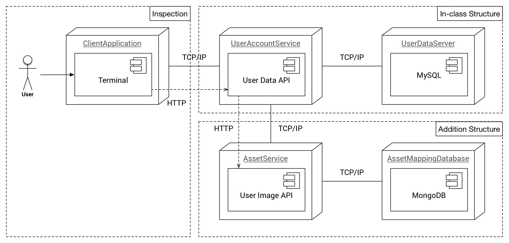

# Container Structure

โครงสร้าง Container ที่ต้องการ



Container ด้านบน เป็นโครงสร้างสำหรับโปรแกรมค้นหาข้อมูลผู้ใช้งาน โดยดัดแปลงและเพิ่มเติมจากที่ได้บรรยายไปในชั้นเรียน 
ซึ่งการทำงานของโปรแกรมนี้คือ 

1. จะเริ่มต้นใช้งานจาก _ClientApplication_ ภายในส่วน *Inspection* (กล่องนี้ไม่ต้องทำ) ด้วยการส่งชื่อ *username* ที่ต้องการค้นหาให้กับ _UserAccountService_ ผ่านการร้องขอข้อมูลแบบ GET ของโปรโตคอล HTTP ซึ่งอยู่ใน *In-class Structure* 
1. *In-class Structure* จะเป็นโครงสร้างเช่่นเดียวกันกับที่บรรยายในชั้นเรียน โดยที่ _UserAcountService_ จะรับข้อมูล *username* เพื่อค้นหาหมายเลขโทรศัพท์ของ *username* ดังที่ระบุ จากฐานข้อมูล MySQL ภายใน _UserDataServer_ 
1. _UserDataServer_ นั้นได้เตรียมข้อมูลตั้งต้นไว้ภายในโฟลเดอร์ **user_data** แล้วเรียบร้อย
1. นอกจากพฤติกรรมปกติตามที่บรรยายในชั้นเรียนแล้ว ได้ปรับเพิ่มให้ _UserAccountService_ นั้นส่ง *username* ไปยัง _AssetService_ เพื่อนำไปค้นหาข้อมูลรูปภาพที่ตรงกันกับ *username* ที่ต้อง 

ทำเฉพาะ **In-class Structure** และ **Addition Structure** 

## ผลลัพธ์ที่ต้องการ

**ข้อมูลนำเข้า** ชื่อผู้ใช้งาน เช่น **alice**, **bob** หรือ **carol**

**ข้อมูลส่งออก** ชื่อผู้ใช้งาน, หมายเลขโทรศัพท์, url ที่อยู่ในรูปของ JSON 

## ตัวอย่าง

### ข้อมูลนำเข้า
ในกรณีที map port 80 จาก _UserAccountService_ มายัง port 80 ของเครื่อง Host OS
```bash
$ curl -L http://localhost/?username=alice
```

### ข้อมูลส่งออก
```json
{
  "username": "alice",
  "phone_number": "1234567890",
  "profile_image": "https://picsum.photos/1000"
}
```

## Asset Mapping Database

เพื่ออำนวยความสะดวก ได้จัดเตรียม AssetMappingDatabase พร้อมทั้งเพิ่มข้อมูลด้านในไว้ให้แล้วเรียบร้อย เมื่อ Build container ด้วยการเรียกใช้งานคำสั่งด้านล่างจะได้ข้อมูลตามด้านล่าง

```bash
$ docker-compose build
$ docker-compose up -d
$ docker exec -it userinfo_asset_mapping_1 mongo
> use user
> db.userProfile.find()
{ "_id" : ObjectId("59f03cfa6574d1b68c74caf6"), "user_id" : "5C66F17A-534E-48C2-8352-2631EBC61094", "uname" : "trudy", "profile_image" : "https://picsum.photos/900?random", "last_update" : 1508821332 }
{ "_id" : ObjectId("59f03cfa6574d1b68c74caf7"), "user_id" : "610982C8-226A-483B-B597-22B0768C82AF", "uname" : "carol", "profile_image" : "https://picsum.photos/1000", "last_update" : 1508821332 }
{ "_id" : ObjectId("59f03cfa6574d1b68c74caf8"), "user_id" : "D4660FDE-180D-4535-8D97-B94BA226B72C", "uname" : "eve", "profile_image" : "https://picsum.photos/1000", "last_update" : 1508821332 }
{ "_id" : ObjectId("59f03cfa6574d1b68c74caf9"), "user_id" : "C916EA7C-C9C7-4564-AA38-46F0B1CFB915", "uname" : "bob", "profile_image" : "https://picsum.photos/1000", "last_update" : 1508821332 }
{ "_id" : ObjectId("59f03cfa6574d1b68c74cafa"), "user_id" : "0888D506-108D-44BF-B75B-F8406CD9C4D4", "uname" : "alice", "profile_image" : "https://picsum.photos/1000", "last_update" : 1508821332 }
{ "_id" : ObjectId("59f03cfa6574d1b68c74cafb"), "user_id" : "BCE16C91-69BD-4FB4-9066-CFE01CEBC8B2", "uname" : "frank", "profile_image" : "https://picsum.photos/g/1000?random", "last_update" : 1508821332 }
{ "_id" : ObjectId("59f03cfa6574d1b68c74cafc"), "user_id" : "C6347A77-41ED-446C-BDD1-318904436209", "uname" : "arthur", "profile_image" : "http://placebeard.it/g/1000", "last_update" : 1508821332 }
{ "_id" : ObjectId("59f03cfa6574d1b68c74cafd"), "user_id" : "FE640501-C0AC-489C-85FC-A8F1F32D38F1", "uname" : "sybil", "profile_image" : "https://picsum.photos/800?random", "last_update" : 1508821332 }
{ "_id" : ObjectId("59f03cfa6574d1b68c74cafe"), "user_id" : "A47CC1B8-0B92-48D0-B681-5BAA346008C2", "uname" : "victor", "profile_image" : "https://picsum.photos/g/1200?randome", "last_update" : 1508821332 }
{ "_id" : ObjectId("59f03cfa6574d1b68c74caff"), "user_id" : "A5C99AF6-A200-4CA7-AC5B-FA06B9AE2CFA", "uname" : "walter", "profile_image" : "http://placebeard.it/1000", "last_update" : 1508821332 }
{ "_id" : ObjectId("59f03cfa6574d1b68c74cb00"), "user_id" : "94F7BD72-8BB4-4E9A-9A77-35A4B079AF90", "uname" : "oscar", "profile_image" : "https://picsum.photos/g/1500", "last_update" : 1508821332 }
```
